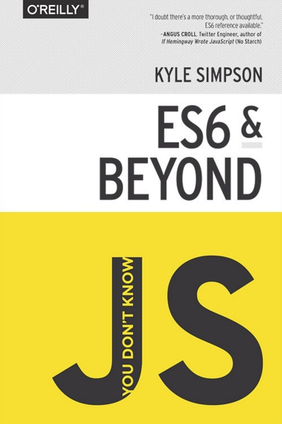

# You Don't Know JS: ES6 & Beyond - 1st Edition

| UPDATE: You are viewing the 1st edition of the book series, as they were published by O'Reilly from 2014-2015. As of now, [2nd edition](https://github.com/getify/You-Dont-Know-JS/tree/2nd-ed) work is underway. Any issues or PRs should be directed against the latest edition. |
| :--- |

----
----

-----

**[Purchase digital/print copy from O'Reilly](http://shop.oreilly.com/product/0636920033769.do)**

-----

[Table of Contents](Learning/Books/You-Dont-Know-JS/es6%20&%20beyond/toc.md)

* [Foreword](Learning/Books/You-Dont-Know-JS/es6%20&%20beyond/foreword.md) (by [Rick Waldron](http://bocoup.com/weblog/author/rick-waldron/))
* [Preface](../preface.md)
* [Chapter 1: ES? Now & Future](Learning/Books/You-Dont-Know-JS/es6%20&%20beyond/ch1.md)
* [Chapter 2: Syntax](Learning/Books/You-Dont-Know-JS/es6%20&%20beyond/ch2.md)
* [Chapter 3: Organization](Learning/Books/You-Dont-Know-JS/es6%20&%20beyond/ch3.md)
* [Chapter 4: Async Flow Control](ch4.md)
* [Chapter 5: Collections](ch5.md)
* [Chapter 6: API Additions](ch6.md)
* [Chapter 7: Meta Programming](ch7.md)
* [Chapter 8: Beyond ES6](ch8.md)
* [Appendix A: Thank You's!](Learning/Books/You-Dont-Know-JS/es6%20&%20beyond/apA.md)
